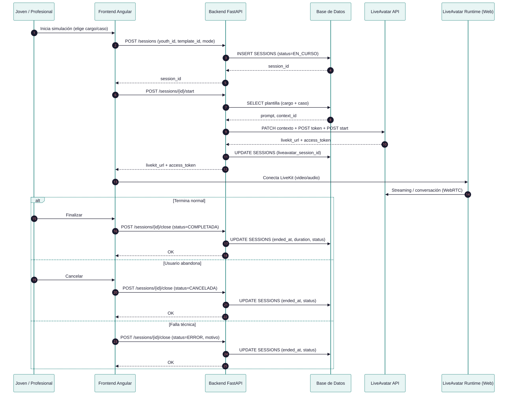

# Arquitectura de la plataforma ELVIR

## 1. Visión general

La plataforma ELVIR se implementa como una aplicación web con arquitectura cliente–servidor, diseñada para habilitar simulaciones de entrevistas laborales mediante la integración de un servicio externo de avatar e IA (LiveAvatar).

El sistema se concibe como un **MVP (demo funcional)**, cuyo foco está en validar flujos de uso, arquitectura técnica e integración end-to-end con el servicio externo, más que en entregar un producto final productivo. En este contexto, se prioriza la claridad del diseño, la trazabilidad de la información y la separación de responsabilidades entre componentes.

---

## 2. Componentes principales

La arquitectura se organiza en tres componentes principales claramente diferenciados:

### 2.1 Frontend (Cliente Web)

El frontend corresponde a una aplicación web desarrollada en **Angular (TypeScript/JavaScript)**, accesible desde navegador, y utilizada tanto por jóvenes como por profesionales.

Sus responsabilidades principales son:

- Proveer la interfaz de usuario para ambos roles.
- Implementar los flujos definidos (inicio de sesión, simulación, historial, material de apoyo y seguimiento).
- Consumir la API REST del backend.
- Integrar **visualmente** la experiencia del avatar de LiveAvatar dentro de la plataforma, de modo que la simulación se perciba como parte de ELVIR.

**Sobre la integración del avatar (punto de riesgo señalado):**  
El “riesgo” no es solo que funcione técnicamente, sino que la experiencia se sienta *inmersa* (sin que parezca “un link externo”). Por eso el diseño contempla al menos dos modalidades posibles:

- **Embebido** (iframe / webview / URL de sesión)
- **Runtime/SDK en navegador** (componente JS que se inicializa dentro de la UI y uno controla layout, contenedores, etc.)

ELVIR debe poder soportar cualquiera de las dos, dependiendo de lo que LiveAvatar permita finalmente.

El frontend no contiene lógica de negocio crítica ni implementación de IA; actúa como capa de presentación y orquestación de la experiencia de usuario.

---

### 2.2 Backend (Servidor de aplicación)

El backend se implementa como una API REST desarrollada en **Python (FastAPI)**. Este componente actúa como **núcleo orquestador del sistema**.

Sus responsabilidades incluyen:

- Autenticación y autorización de usuarios por rol (joven, profesional, administrador).
- Gestión de perfiles de jóvenes y profesionales.
- Creación, cierre y registro de sesiones de simulación.
- Persistencia de información en la base de datos.
- **Integración con LiveAvatar (Context Dinámico):** antes de cada sesión, el backend obtiene el prompt correspondiente (contenido creado por Catalina; ver `docs/referencia-catalina`), hace PATCH al contexto en LiveAvatar, crea la sesión y devuelve token/URL al frontend.
- Guardar referencias técnicas (`liveavatar_session_id`, URLs, payloads, etc.).

El backend mantiene el estado del sistema y define límites claros entre ELVIR y el servicio externo, evitando acoplamiento excesivo con el proveedor.

---

### 2.3 Servicio externo (LiveAvatar)

La IA conversacional con avatar se consume como un **servicio externo**, tratado explícitamente como una *caja negra*.

Características clave de esta integración:

- **ELVIR** = plataforma web (frontend + backend). No implementa IA conversacional.
- **LiveAvatar** = servicio externo que provee avatar + conversación. La transcripción, las preguntas y la lógica conversacional ocurren ahí.
- El backend de ELVIR obtiene el prompt (contenido de Catalina) y lo envía a LiveAvatar antes de cada sesión (Context Dinámico).
- En el demo original había 16 contexts predefinidos en LiveAvatar; en ELVIR se usa un único contexto actualizado dinámicamente.
- LiveAvatar podría integrarse mediante embebido (iframe) y/o runtime/SDK en el navegador.

> Importante: ELVIR es responsable de la plataforma web y su trazabilidad. LiveAvatar provee la experiencia del avatar + conversación.  
> Si LiveAvatar expone resultados (resúmenes/evaluaciones) ELVIR puede **almacenarlos y mostrarlos**, pero no implementa esos modelos internamente en el MVP.

---

## 3. Persistencia y modelo de datos

La capa de persistencia se implementa mediante una base de datos relacional, utilizada por el backend para almacenar la información necesaria para el funcionamiento del MVP.

A alto nivel, el sistema persiste:

- Usuarios y roles de acceso.
- Perfiles de jóvenes y profesionales.
- Relaciones de asignación entre jóvenes y profesionales.
- Plantillas de simulación (configuración estática / mapeos hacia LiveAvatar si aplica).
- Sesiones de simulación (ejecuciones concretas).
- Estados, métricas básicas y eventos de sesión.
- Resúmenes cualitativos y seguimiento (principalmente del profesional).
- Material de apoyo y su consumo.

Una decisión clave de diseño es la **separación entre plantillas de simulación y sesiones**, lo que permite reutilizar configuraciones y registrar múltiples intentos por joven sin duplicar información.

El detalle del modelo entidad–relación se documenta en la carpeta `/docs/modelo-datos`.

---

## 4. Flujo técnico de una simulación

De forma simplificada, el flujo técnico de una simulación es el siguiente:

1. El usuario (joven o profesional) selecciona cargo + caso e inicia una simulación desde el frontend.
2. El frontend solicita al backend la creación de una nueva sesión y su inicio.
3. El backend:
   - Valida permisos y contexto.
   - Registra la sesión en la base de datos.
   - Obtiene el prompt correspondiente (archivos de Prompt Builder o catálogo en BD; contenido de Catalina).
   - Hace PATCH al contexto en LiveAvatar con ese prompt.
   - Crea la sesión en LiveAvatar (token, start) y obtiene `livekit_url` + `access_token`.
   - Devuelve al frontend la información para conectar a LiveKit.
4. El frontend conecta a LiveKit y reproduce la experiencia del avatar.
5. La interacción conversacional se ejecuta en LiveAvatar (caja negra); ELVIR no gestiona la conversación ni la IA.
6. Al finalizar, el backend cierra la sesión y registra estado y métricas básicas.

Este flujo permite mantener control del estado y la trazabilidad sin implementar IA conversacional internamente.

---

## 5. Secuencia detallada de interacción

Para complementar la descripción general del flujo técnico, se incluye un diagrama de secuencia que muestra con mayor precisión cómo interactúan los distintos componentes durante el ciclo completo de una simulación (creación, inicio e cierre).

Este diagrama permite visualizar:

- La creación y persistencia de la sesión en el backend.
- La coordinación con la API de LiveAvatar.
- La inicialización del runtime del avatar en el frontend.
- El cierre de sesión y actualización del estado oficial en ELVIR.

El objetivo de incluir esta vista es reforzar la separación de responsabilidades entre frontend, backend y servicio externo, mostrando explícitamente que el backend mantiene el estado oficial del sistema mientras que LiveAvatar gestiona la conversación.

**Fuente Mermaid:** `docs/modelo-datos/sequence-simulacion.mmd`. Para regenerar: `npx @mermaid-js/mermaid-cli mmdc -i docs/modelo-datos/sequence-simulacion.mmd -o docs/arquitectura/ddsecuencias.svg -c docs/modelo-datos/mermaid-config.json`

---

## 6. Estados y trazabilidad

Cada sesión de simulación maneja un conjunto acotado de estados:

- `EN_CURSO`
- `COMPLETADA`
- `CANCELADA`
- `ERROR`

Esta clasificación permite diferenciar entre sesiones exitosas, interrupciones voluntarias y fallas técnicas, facilitando el análisis posterior del uso del sistema y la estabilidad de la integración con LiveAvatar.

Adicionalmente, se pueden registrar eventos relevantes asociados a una sesión (por ejemplo: `CREATED`, `LIVEAVATAR_STARTED`, `ENDED`, `ERROR`) para reforzar la trazabilidad sin introducir complejidad innecesaria.

---

## 7. Consideraciones de diseño y alcance

La arquitectura propuesta busca un equilibrio entre simplicidad y extensibilidad:

- Se evita la sobreingeniería, manteniendo una estructura clara y directa.
- Se prioriza la separación de responsabilidades entre capas.
- Se documentan explícitamente las decisiones y límites del MVP.
- Se deja espacio para ajustes cuando se confirme el mecanismo exacto de integración con LiveAvatar.

Fuera del alcance del desarrollo ELVIR (MVP):

- Implementar o entrenar modelos de IA propios.
- Análisis avanzado de desempeño y métricas complejas.
- Persistencia de audio o video.
- Funcionalidades propias de un producto productivo.

> Nota: si LiveAvatar entrega resúmenes, evaluaciones o resultados automáticos, ELVIR puede **registrarlos y visualizarlos**, pero no los implementa internamente en esta etapa.

---

## Diagrama de arquitectura

---
