# Flujos de usuario – Plataforma ELVIR

Este documento describe los flujos principales de uso de la plataforma ELVIR para los tres roles: **Joven**, **Profesional** y **Admin**.  
Los flujos se diseñan considerando tanto la experiencia de usuario como su impacto directo en la lógica del backend y el modelo de datos.

**Fuentes Mermaid:** Los diagramas se generan desde `docs/modelo-datos/flowchart TD.txt`, `flowchart TD2.txt`, `flowchart-flujo-admin.mmd`, `flowchart-flujo-profesional.mmd`, `flowchart-flujo-joven.mmd`, `flowchart-roles.mmd`, `flowchart-liveavatar.mmd`, `flowchart-activacion.mmd`, `stateDiagram-v2.txt` y `sequence-simulacion.mmd`. Para regenerar SVGs: usar [Mermaid Live Editor](https://mermaid.live) o `npx @mermaid-js/mermaid-cli`.

---

## 0. Resumen de roles

---

## 1. Principios de diseño de los flujos

Las decisiones de flujo se basan en los siguientes principios:

- **Separación clara de roles**: el joven y el profesional cumplen funciones distintas y requieren interfaces y recorridos diferentes.
- **Simplicidad cognitiva**: los flujos del joven se mantienen acotados y guiados.
- **Flexibilidad operativa**: se permite tanto el acceso autogestionado del joven como sesiones supervisadas por un profesional.
- **Trazabilidad**: cada acción relevante genera registros claros en el backend (sesiones, estados, métricas).
- **Desacoplamiento del servicio externo**: la ejecución conversacional ocurre en LiveAvatar, mientras que ELVIR mantiene el control del estado y la persistencia.

---

## 2. Flujo del Joven

### 2.1 Descripción general

El flujo del joven se estructura como un ciclo simple y repetible:

1. Acceso al sistema.
2. Inicio de una nueva simulación o revisión de historial.
3. Ejecución de la simulación con el avatar (LiveAvatar).
4. Cierre de la sesión.
5. Acceso a material de apoyo sugerido.

Este ciclo refuerza la idea de práctica progresiva y aprendizaje posterior a cada simulación.

---

### 2.2 Acceso al sistema

Se contemplan dos modalidades de acceso:

- **Acceso con login propio**: el joven inicia sesión con credenciales personales.
- **Acceso supervisado**: el profesional inicia la sesión en nombre del joven, sin requerir credenciales propias.

Esta decisión responde a la realidad de Teletón, donde no todos los jóvenes cuentan con el mismo nivel de autonomía digital.

---

### 2.3 Inicio de simulación

Al iniciar una nueva simulación:

- El sistema crea una nueva entidad **SESSIONS** en el backend.
- Se asocia a una configuración válida (plantilla: cargo × caso).
- El backend obtiene el prompt (contenido de Catalina desde JOB_ROLES + CASES), hace PATCH al contexto en LiveAvatar, crea la sesión y devuelve token/URL al frontend. 16 plantillas (4 cargos × 4 casos). Ver `docs/propuesta/integracion-liveavatar.md` y `docs/modelo-datos/flowchart-liveavatar.mmd`.
- El frontend conecta a LiveKit e integra visualmente la experiencia del avatar.

> Nota: Dependiendo de la configuración, el joven podría seleccionar únicamente el **cargo**; el caso (dificultad) puede resolverse por defecto o por plantilla preestablecida.

---

### 2.4 Ejecución y cierre

Durante la ejecución:

- La conversación ocurre en LiveAvatar.
- ELVIR mantiene el estado de la sesión.
- Se registran timestamps y estado final.

Al finalizar:

- Se marca la sesión como `COMPLETADA`, `CANCELADA` o `ERROR`.
- Se almacenan métricas básicas (duración, timestamps, etc.).
- Se habilita la visualización posterior del intento.

---

### 2.5 Estados relevantes registrados

Durante este flujo, el backend registra:

- Creación de sesión.
- Inicio técnico de experiencia con avatar.
- Finalización normal, cancelación o error.
- Métricas básicas (duración, timestamps).
- Vinculación opcional a resumen cualitativo o sugerencia de material.

---

## 3. Flujo del Profesional

### 3.1 Descripción general

El flujo del profesional está orientado a la **gestión y seguimiento** de múltiples jóvenes.  
La pantalla principal se concibe como una **tabla/listado**, desde la cual se accede a todas las acciones relevantes.

Las acciones principales del profesional son:

- Crear y administrar perfiles de jóvenes.
- Visualizar historial de sesiones.
- Iniciar sesiones supervisadas.
- Registrar resúmenes cualitativos.
- Sugerir material de apoyo.
- Subir material propio (visible solo para él y sus jóvenes asignados).

---

### 3.2 Pantalla principal del profesional

La vista principal corresponde a un listado de jóvenes, con columnas clave como:

- Nombre / identificador.
- Estado general.
- Última sesión realizada.
- Acciones (ver perfil, editar, desactivar, ver historial).

Este enfoque prioriza la eficiencia operativa y la trazabilidad.

---

### 3.3 Inicio de sesión supervisada

Cuando el profesional inicia una sesión:

- Selecciona al joven.
- Define el contexto de la simulación (según configuración disponible).
- El backend crea la sesión.
- Se inicia la experiencia con LiveAvatar en modo supervisado.

---

### 3.4 Crear joven y credenciales (flujo de invitación)

Cuando el profesional crea un joven con **login habilitado**, el sistema usa un **flujo de invitación por enlace** para que el joven defina su propia contraseña de forma segura:

1. El profesional ingresa los datos del joven y marca "Login habilitado".
2. El profesional ingresa el **email** del joven (obligatorio si login habilitado).
3. El backend crea el perfil YOUTH (sin credenciales aún) y genera una **invitación** con token único.
4. El backend devuelve un **enlace de activación** (ej. `https://elvir.app/activar?token=xxx`).
5. El profesional entrega el enlace al joven (en persona, WhatsApp, etc.).
6. El joven abre el enlace y define su **contraseña** en la pantalla de activación.
7. El backend crea el usuario (USERS), lo vincula al YOUTH e invalida la invitación.
8. El joven puede iniciar sesión con su email y contraseña.

**Ventajas:** El profesional nunca conoce la contraseña; el joven la define. No se requiere servicio de email; el enlace se entrega por cualquier canal.

Si el profesional marca "Login deshabilitado", el joven solo accede mediante **sesiones supervisadas** (el profesional inicia la simulación en su nombre).

---

## 4. Estados de una sesión de simulación

Cada simulación se modela explícitamente como una **sesión**, con un conjunto acotado de estados.

### 4.1 Estados definidos

- `EN_CURSO`: la simulación está activa.
- `COMPLETADA`: la simulación finaliza correctamente.
- `CANCELADA`: el usuario abandona voluntariamente.
- `ERROR`: ocurre una falla técnica (API externa, red, etc.).

Esta distinción permite diferenciar claramente interrupciones voluntarias de problemas técnicos.

---

## 5. Relación con el backend y modelo de datos

Los flujos descritos en este documento se reflejan directamente en:

- La creación y actualización de registros en la entidad **SESSIONS**.
- La separación entre configuraciones de simulación y ejecuciones concretas.
- El registro de estados y eventos asociados a cada sesión.
- La vinculación entre sesiones, resúmenes cualitativos y material de apoyo.

El detalle de estas entidades se describe en el documento de modelo de datos (`/docs/modelo-datos`).

---

## 6. Alcance y extensiones futuras

Los flujos definidos cubren el alcance del MVP.  
Quedan explícitamente fuera de este documento:

- Implementación interna de IA.
- Análisis avanzado automatizado.
- Persistencia de audio o video.
- Evaluación automática desarrollada dentro de ELVIR.

Si LiveAvatar entrega resultados automáticos (resúmenes, etiquetas o evaluaciones), ELVIR podrá almacenarlos y visualizarlos sin implementarlos internamente.

---

## 7. Flujo del Admin

El Admin accede con credenciales propias (`admin@test.cl` en desarrollo) y puede:

- **Crear profesionales:** formulario con email, contraseña inicial, nombre, especialidad e institución.
- **Subir material general:** material visible para todos los profesionales y jóvenes (`created_by` = null).

El Admin **no gestiona** catálogos (cargos, casos, plantillas de simulación); eso es responsabilidad externa.

**Fuente Mermaid:** `docs/modelo-datos/flowchart-flujo-admin.mmd`
