# Modelo de datos – Plataforma ELVIR

Este documento describe el modelo de datos propuesto para el MVP de la plataforma ELVIR.  
El objetivo del diseño es **soportar los flujos definidos**, asegurar trazabilidad de las simulaciones y mantener flexibilidad para futuras extensiones, sin sobrecargar el sistema con complejidad innecesaria.

El modelo se encuentra alineado con:

- La arquitectura cliente–servidor.
- La integración con LiveAvatar como servicio externo.
- El enfoque MVP (sin lógica de IA propia en esta etapa).

---

## 1. Principios de diseño del modelo de datos

El modelo de datos se diseñó considerando los siguientes principios:

- **Separación de responsabilidades**: distinguir entre credenciales, perfiles funcionales, configuraciones y ejecuciones.
- **Trazabilidad completa**: cada simulación debe poder rastrearse en el tiempo.
- **Flexibilidad**: evitar campos rígidos que dificulten futuras extensiones.
- **Desacoplamiento del proveedor externo**: LiveAvatar se trata como caja negra.
- **Alineación con flujos**: el modelo refleja directamente los flujos del joven y del profesional.
- **MVP first**: se prioriza lo necesario para una demo funcional.

---

## 2. Diagrama entidad–relación

El siguiente diagrama muestra las entidades principales y sus relaciones.

---

## 3. Usuarios y perfiles

### 3.1 USERS

La entidad **USERS** representa las credenciales de acceso al sistema.

Contiene:

- `id`
- `email`
- `password_hash`
- `role` (JOVEN, PROFESIONAL, ADMIN)
- `is_active`
- `created_at`
- `updated_at`

Características:

- Gestiona autenticación y control de acceso.
- No almacena información clínica ni educativa.
- Se desacopla del dominio funcional.

---

### 3.2 YOUTH (Jóvenes)

La entidad **YOUTH** representa el perfil funcional del joven dentro de la plataforma.

Características clave:

- Puede o no estar asociado a un registro en USERS (`user_id` nullable).
- Incluye `login_enabled` para soportar acceso autónomo o supervisado.
- Contiene información básica, `general_notes` y `profile_checklist` (checklist de perfil postulante: competencias/características marcadas por el profesional).

Esto permite soportar:

- Jóvenes con credenciales propias.
- Jóvenes que operan únicamente en modo supervisado.

---

### 3.3 PROFESSIONALS

La entidad **PROFESSIONALS** representa a los profesionales que utilizan la plataforma.

Características:

- Siempre se asocia a un usuario autenticado (`user_id` obligatorio).
- Contiene información institucional y de especialidad.
- No almacena datos de jóvenes directamente.
- Los profesionales son creados por un usuario con rol ADMIN (no hay auto-registro).

---

### 3.4 ASSIGNMENTS

La relación entre jóvenes y profesionales se modela explícitamente mediante la entidad **ASSIGNMENTS**.

Contiene:

- `youth_id`
- `professional_id`
- `status`
- `assigned_at`
- `ended_at`

Ventajas:

- Permite cambios de profesional responsable.
- Mantiene historial.
- Evita múltiples campos FK directos en YOUTH.

---

## 4. Dominio de simulaciones

### 4.1 JOB_ROLES

Representa los cargos o puestos laborales disponibles en el sistema.

Ejemplos:

- Vendedor(a) Retail
- Recepcionista

Este catálogo es interno a ELVIR y permite:

- Construir dropdowns en frontend.
- Desacoplar el dominio de los contexts internos de LiveAvatar.

**Integración Context Dinámico:** los campos opcionales `description`, `objetivo` y `competencias` permiten construir el prompt dinámico para LiveAvatar (ver `docs/integracion-liveavatar.md`).

---

### 4.2 CASES

Representa los tipos de entrevista o niveles de dificultad.

Ejemplos:

- NORMAL
- BAJA
- MEDIA
- ALTA

Importante:

Aunque en el demo existen 4 casos × 4 cargos definidos como contexts en LiveAvatar, en ELVIR se modelan como entidades del dominio para mantener trazabilidad y evitar hardcodeo.

**Integración Context Dinámico:** el campo opcional `prompt_instructions` contiene las instrucciones de intervención (regulación emocional, presentación, expectativas) para construir el prompt dinámico.

---

### 4.3 SIMULATION_TEMPLATES

La entidad **SIMULATION_TEMPLATES** define configuraciones reutilizables de simulación.

Incluye:

- `job_role_id`
- `case_id`
- `liveavatar_context_id`
- `liveavatar_avatar_id`
- `liveavatar_voice_id`
- `is_active`

Esta entidad actúa como **mapeo entre el dominio ELVIR y LiveAvatar**.

No representa ejecuciones reales.

---

## 5. Sesiones (ejecuciones reales)

### 5.1 SESSIONS

La entidad **SESSIONS** representa cada ejecución concreta de una simulación.

Contiene:

- `youth_id`
- `professional_id` (nullable si es autogestionada)
- `simulation_template_id`
- `mode` (AUTOGESTIONADA o SUPERVISADA)
- `liveavatar_session_id`
- `started_at`
- `ended_at`
- `status`
- `duration_seconds`
- `metrics` (JSON)

Esta entidad permite:

- Diferenciar claramente entre configuración y ejecución.
- Registrar múltiples intentos por joven.
- Mantener trazabilidad frente a LiveAvatar.

---

### 5.2 Estados de sesión

Cada sesión puede encontrarse en:

- EN_CURSO
- COMPLETADA
- CANCELADA
- ERROR

Esto permite:

- Analizar estabilidad técnica.
- Diferenciar abandono voluntario vs falla técnica.
- Generar métricas simples de uso.

---

### 5.3 SESSION_EVENTS

Permite registrar eventos relevantes:

- CREATED
- LIVEAVATAR_STARTED
- ENDED
- ERROR

Es opcional para el MVP, pero aporta trazabilidad frente al riesgo de integración con LiveAvatar.

---

## 6. Seguimiento cualitativo

### 6.1 INTERVIEW_SUMMARIES

Almacena resúmenes cualitativos asociados a una sesión.

Importante:

En el MVP, estos resúmenes pueden:

- Ser redactados por el profesional.
- Ser almacenados si LiveAvatar entrega algún resultado automático.

ELVIR no implementa la IA de evaluación internamente en esta etapa en caso de que se pida.

---

## 7. Competencias

El modelo separa evaluación estructurada en:

- **COMPETENCIES** (catálogo)
- **COMPETENCY_LEVELS** (BAJO, MEDIO, ALTO)
- **SESSION_COMPETENCIES** (evaluación por sesión)

Ventajas:

- Evita agregar columnas fijas en YOUTH.
- Permite ampliar catálogo sin alterar estructura base.
- Mantiene evaluación desacoplada del perfil permanente del joven.

---

## 8. Material de apoyo

El material de apoyo se modela mediante:

### 8.1 SUPPORT_MATERIAL

Catálogo de recursos disponibles. Puede ser creado por:
- **ADMIN:** material general (`created_by` null), visible para todos.
- **PROFESIONAL:** material propio (`created_by` = professional_id), visible solo para sus jóvenes asignados.

### 8.2 MATERIAL_SUGGESTIONS

Sugerencias hechas por el profesional (opcionalmente vinculadas a una sesión).

### 8.3 MATERIAL_VIEWS

Registro de consumo efectivo del material por parte del joven.

Este diseño permite diferenciar:

- Material disponible.
- Material recomendado.
- Material efectivamente utilizado.

---

## 9. Relación con arquitectura

Este modelo:

- No implementa lógica de IA.
- No replica internamente la conversación.
- Trata LiveAvatar como proveedor externo.
- Mantiene en ELVIR solo:
  - Estado
  - Identificadores técnicos
  - Trazabilidad
  - Seguimiento profesional

---

